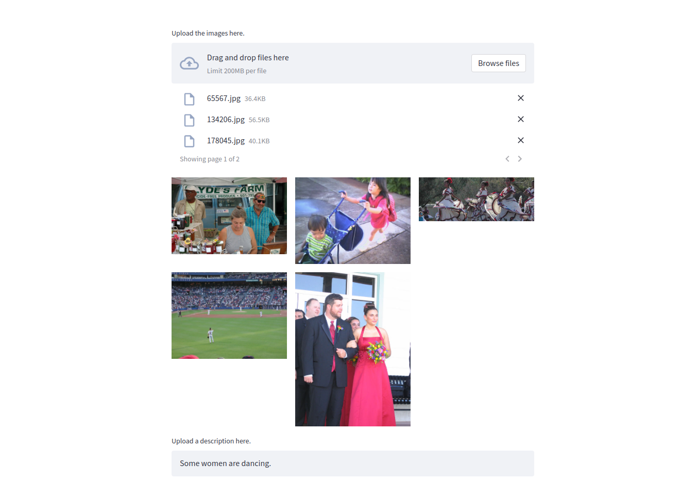
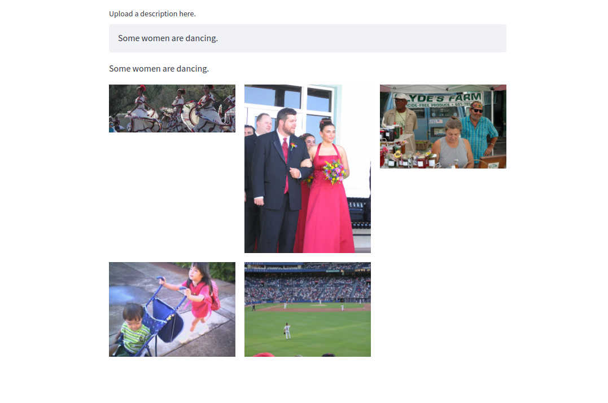

This repository contains the code for text and image similarity using contrastive learning. The mode training code is taken from https://github.com/fartashf/vsepp. The training details can be found in that repo. I created a frontend for this using [Streamlit](https://streamlit.io/), and [FastAPI](https://fastapi.tiangolo.com/) is used for the backend. Now, if some images and text are given as input, then the model can rank the images on the basis of the similarity with the given text.

To create and activate the environment:

```
conda env create -f environment.yml
conda activate im2txt
```

If adding any new requirements, add them to requirements.in and do:

`pip-compile requirements.in`

To install the requirements in already generated requirements.txt, do:

`pip-sync requirements.txt`

To add the environment to the jupyter notebook, do:

`python -m ipykernel install --user --name=im2txt`

To run the frontend, do:

`streamlit run src/frontend_streamlit.py`

To run the api, do:

`python src/api.py`



Now, once we add the text, the images will be added in the order of their similarity.

